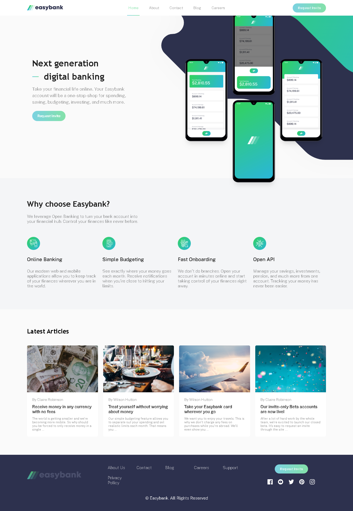

# Easybank Landing Page

This repository contains the code for an Easybank landing page. The project includes HTML, CSS, and JavaScript files to create a responsive and interactive webpage.

## Getting Started

To view this project locally, follow these instructions:

1. Clone this repository:

2. Open the `index.html` file in your preferred web browser.

## Features

- **Responsive Design**: The webpage is designed to be responsive across different screen sizes and devices.
- **Interactive Navigation**: The navigation menu dynamically scrolls to different sections of the page.
- **Animated Toggle Menu**: The mobile navigation menu is toggled with a stylish animated icon.
- **Scroll-to-Top Button**: A button appears when scrolling down and allows users to quickly return to the top of the page.
- **Modern Design**: Utilizes modern design principles with attractive visuals and fonts.

## Technologies Used

- HTML
- CSS
- JavaScript

## Preview

## Credits

This project was created as part of a web development course by [Gerges Samuel]. Feel free to use and modify the code for your own projects.

For inquiries, please contact [josamdesign@gmail.com].

---

© 2024 Easybank. All Rights Reserved.
